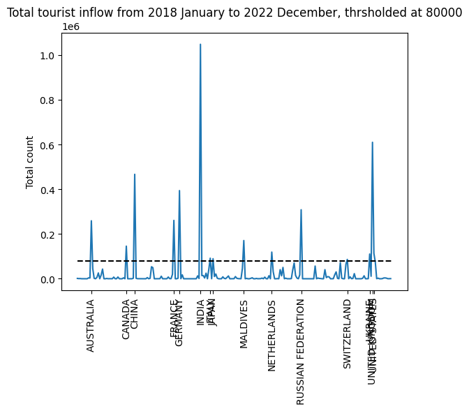
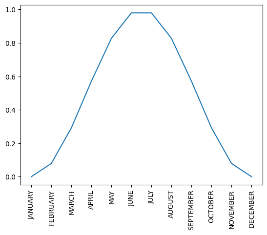
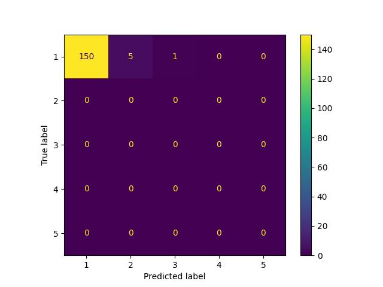
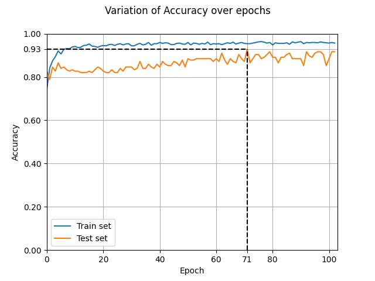
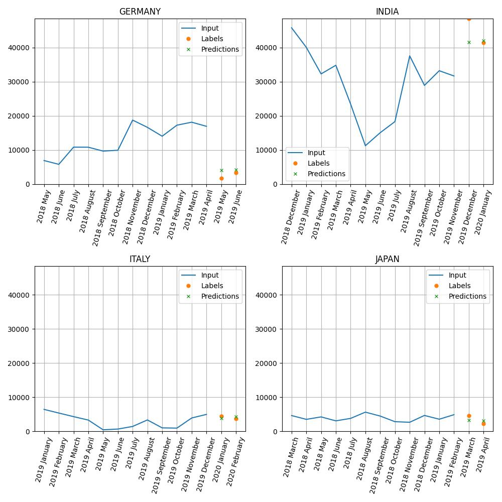
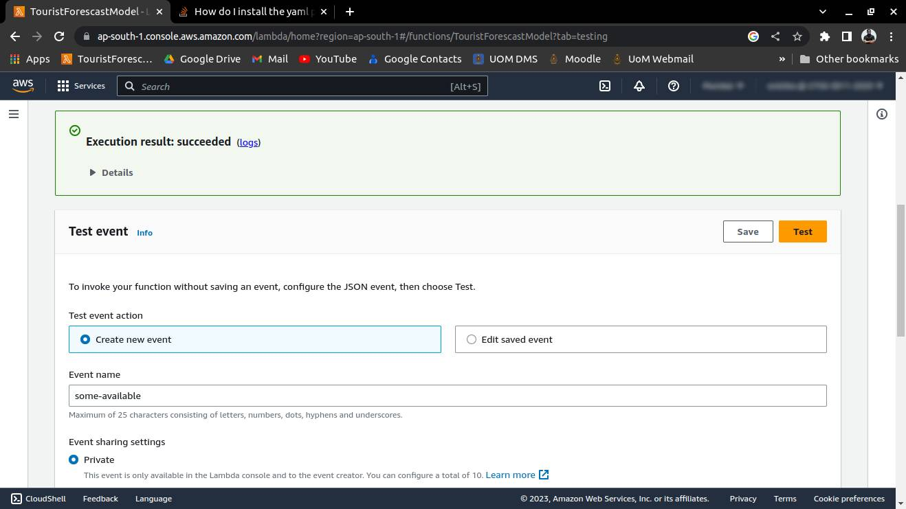

## Data processing

### Country selection

-   The countries were filtered to extract the major countries from which tourists come to Sri Lanka
-   The criteria for this filtering was taken as, from the total tourist counts from each country from 2018 January to 2022 December.
-   The threshold for this limit was taken as 80,000 arivals
    
-   The filtered countries were
    -   AUSTRALIA
    -   CANADA
    -   CHINA
    -   FRANCE
    -   GERMANY
    -   INDIA
    -   ITALY
    -   JAPAN
    -   MALDIVES
    -   NETHERLANDS
    -   RUSSIAN FEDERATION
    -   SWITZERLAND
    -   UKRAINE
    -   UNITED KINGDOM
    -   UNITED STATES
-   Out of these countries, the CPI (Consumer Price Index, a measure of infaltion) was not publicaly available for Ukraine, Australia, and Maldives. But the G20 CPI was available. Hence, Maldives was droped from the forecasting, G20 values were adapted in place of Ukraine and Australia

### Data encoding

-   All the datapoints were converted into the numerical formal
-   The months were encoded to capture its position in the year with a function $month_{encoded}=sin(m/11*2*\pi-\pi/2)/2+0.5$. The below graph shows it
    
-   The countries were encoded as onehot encoded vectors

### Data preparation

-   The arival counts from each country was collected and use as the base dataset
-   As contextual data, folowing regarding Sri Lanka was injected to the base dataset
    -   Colombo CPI
    -   Sri Lankan fuel prices
    -   LKR to USD rate
    -   Pandemic status
    -   Crisis status
    -   Infaltion rates
    -   Political stability index value
    -   GDP rate
    -   Mean temperature
    -   Precipitation
-   As other contextual data, the relevant country's CPI was added

### Data windowing

-   The data was windowed with input length 12 timesteps and output length 2 timesteps.
-   The available data was limited from 2018 January to 2022 December.
-   A single timestep reflected statistics of a single month.
-   The dataset was divided 2:1 ratio as train and test set. Since the available data was low, the size of the validation set couldn't be deducted further to maintain the same window width.
-   This resulted in a training set of 358 samples and test set of 78 samples

## Prediction algorithm

Along with the features mentioned in the **Data Preparation** section, windows with input length 12 timesteps and output length 2 timesteps was used. With these parameters, the train set included 358 training examples.

## Model Training

-   The model was trained in a non accelerated device
-   The model parameters was changed and the model parameters and resulting model performances were reported for each run.
-   The model parameters were tweaked to get best results for around 20 runs
-   The model set for training for a large number of epochs setting early stoping tollerance as 30 epochs
-   In the adapted model training run, the training ceased at 103rd epoch, resulting the best model checkpoint at 71th epoch.
-   This checkpoint was adapted for testing and inferencing
-   Model summary is as follows:

```
=================================================================
Layer (type:depth-idx)                   Param #
=================================================================
ForecastModel                            --
├─LSTM: 1-1                              3,584
├─Linear: 1-2                            17
├─Linear: 1-3                            17
├─LSTM: 1-4                              76
=================================================================
Total params: 3,694
Trainable params: 3,694
Non-trainable params: 0
=================================================================
```

-   The model parameters are as follows:

```
hid_feature_count: 16
inp_feature_count: 38
inp_features:
- AUSTRALIA
- CANADA
- CHINA
- FRANCE
- GERMANY
- INDIA
- ITALY
- JAPAN
- NETHERLANDS
- RUSSIAN FEDERATION
- SWITZERLAND
- UKRAINE
- UNITED KINGDOM
- UNITED STATES
- ccpi_alchohol
- ccpi_all_items
- ccpi_clothing
- ccpi_communication
- ccpi_culture
- ccpi_food
- ccpi_housing
- ccpi_restaurants
- ccpi_transport
- count
- country_cpi
- fp_lad
- fp_lp_92
- fp_lp_95
- fp_lsd
- gdp_annual_growth_rate
- inflasion
- is_a_global_pandamic
- is_crisis_situation
- mean_temperature
- month_encoded
- political_stability
- precipitation
- usd_price
inp_seq_len: 12
loss_function: MSELoss
model: ForecastModel
num_layers: 1
optimizer: Adam
out_feature_count: 1
out_features:
- count
out_seq_len: 2
```

## Model Testing

-   The full dataset (csv content) was divided in the 2:1 ratio as training and testing set.

### Confusion Matrix

-   Confusion matrix is not usually defined for time series forecasting.
-   The confusion matrix for this task was defined as follows.
    -   The range of the count was divided into 5 equal segments between 0 and 48442
    -   The confusion matrix was plotted for the test dataset assuming these segments were classes



### Accuracy

-   Since the maximum tourist flow from a country from 2018 to 2022 was recorded as 48442, the predictions which were 5000 people deviated from the real value was taken as accurate.
-   With this accuracy metric, the accuracy of the checkpoint with least validation loss (RMSE) yielded as 93% at the 71st epoch.
-   The variation of the train and test set accuracies are shown below
    

### F1 Score

Not applicable for time series forecasting

### Precision

Not applicable for time series forecasting

### Recall

Not applicable for time series forecasting

### AUC/ROC Curve

Not applicable for time series forecasting

### Benchmarking

### Functional Testing

-   Given below are some window examples
    

### Module and Integration Testing

-   The model performance was tested locally on the test set
-   The backend application was tested in AWS lambda console
    
-   The frontend was tested by the developer

### Limitations of Testing Process

#### Limitation by data

-   The ML model was tested with data from 2018 to 2022. Hence the maximum possible window size was 24 if the dataset was divided in 1:1 ratio.
-   This is the extreme case where only one sample would be available per each country.
-   By selecting the window size of 14 (12 input 2 output) and train test split of 2:1, only 78 trainining samples were available.

#### Limitations by unexpected future trends

-   There were sudden pandemics and crisis situation in Sri Lanka in the past few days.
-   There can be major unanticipated trends like so. These trends were not evaluated

## Dataflow Diagram

## Algorithm Design
